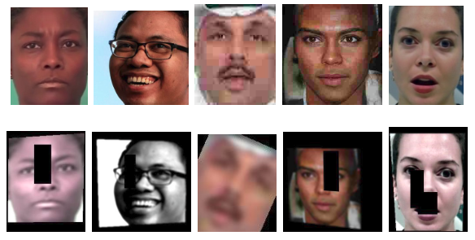
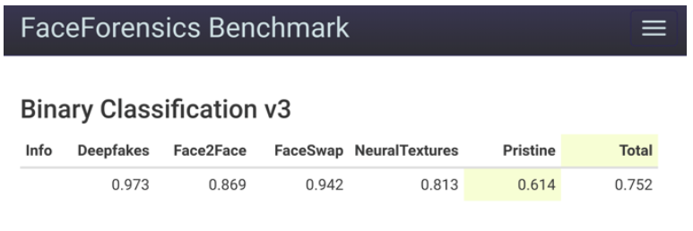

# Deepfake Detection

This repository provides a python implementation of training [EfficientNets](https://arxiv.org/pdf/1905.11946.pdf) w/ and w/o [Attention](https://arxiv.org/pdf/1804.02391.pdf) for classifying Deepfakes.

## Dependencies
Tested on Python 3.8.x.
* [NumPy](http://www.numpy.org/) (1.18.1)
* [Matplotlib](https://matplotlib.org/) (3.2.1)
* [PyTorch](https://pytorch.org/) (1.4.0)
* [torchvision](https://pytorch.org/docs/stable/torchvision/index.html) (0.5.0)
* [Pillow](https://pillow.readthedocs.io/en/stable/#) (7.0.0)
* [scikit-learn](https://scikit-learn.org/stable/index.html#) (0.23.1)
* [Face Recognition Using Pytorch](https://github.com/timesler/facenet-pytorch) (2.3.0)
* [pandas](https://pandas.pydata.org/) (1.0.3)
* [EfficientNet PyTorch](https://github.com/lukemelas/EfficientNet-PyTorch) (0.6.3)
* [OpenCV](https://opencv.org/) (4.3.0.36)

## DFirt
The deepfake classifier is trained on a collection of datasets, i.e. the training set consists of [FaceForensics++](http://www.niessnerlab.org/projects/roessler2019faceforensicspp.html) dataset, [DFFD](http://cvlab.cse.msu.edu/dffd-dataset.html) dataset, 300 sample videos of [DFDC](https://ai.facebook.com/datasets/dfdc/) dataset, [google's deepfake](https://ai.googleblog.com/2019/09/contributing-data-to-deepfake-detection.html) dataset. These datasets are combined and augmented further. As preprocessing step only cropping and resizing of the samples were used. Below you can see exemplary the type of augmentations that were used on the training set. Unfortunately, for legal reasons we cannot provide the dataset we have created.

  
    

## Results

### [DFFD](http://cvlab.cse.msu.edu/dffd-dataset.html)
Below you can see the confusion matrix for each model on the test set.  

#### EfficientNet-B0

|True vs Predicted|Attribute Manipulation|Expression Swap|Entire Face Synthesis|Identity Swap|Real|
|---|---|---|---|---|---|
|Attribute Manipulation|0.947|0.0|0.005|0.0|0.048|
|Entire Face Synthesis|0.0|0.0|1.0|0.0|0.0|

#### EfficientNet-B4 

|True vs Predicted|Attribute Manipulation|Expression Swap|Entire Face Synthesis|Identity Swap|Real|
|---|---|---|---|---|---|
|Attribute Manipulation|0.935|0.0|0.014|0.0|0.051|
|Entire Face Synthesis|0.0|0.0|1.0|0.0|0.0|

#### EfficientNet-B7

|True vs Predicted|Attribute Manipulation|Expression Swap|Entire Face Synthesis|Identity Swap|Real|
|---|---|---|---|---|---|
|Attribute Manipulation|0.974|0.0|0.007|0.0|0.019|
|Entire Face Synthesis|0.0|0.0|1.0|0.0|0.0|

#### EfficientNet-B0 w/ Attention

|True vs Predicted|Attribute Manipulation|Expression Swap|Entire Face Synthesis|Identity Swap|Real|
|---|---|---|---|---|---|
|Attribute Manipulation|0.944|0.0|0.005|0.0|0.051|
|Entire Face Synthesis|0.003|0.0|0.994|0.0|0.003|

### [FaceForensics++](http://www.niessnerlab.org/projects/roessler2019faceforensicspp.html) 

Below you can see the performance of each model on the [FaceForensics++](http://www.niessnerlab.org/projects/roessler2019faceforensicspp.html) automated benchmark.
#### EfficientNet-B0

  
    

#### EfficientNet-B4

|Deepfakes|Face2Face|FaceSwap|NeuralTextures|Pristine|Total|
|---|---|---|---|---|---|
|0.982|0.891|0.990|0.873|0.532|0.729|

#### EfficientNet-B7

|Deepfakes|Face2Face|FaceSwap|NeuralTextures|Pristine|Total|
|---|---|---|---|---|---|
|0.955|0.934|0.961|0.853|0.546|0.733|

#### EfficientNet-B0 w/ Attention

|Deepfakes|Face2Face|FaceSwap|NeuralTextures|Pristine|Total|
|---|---|---|---|---|---|
|0.964|0.905|0.951|0.887|0.512|0.717|

## Demo

You can try it out yourself and classify images/videos or URLs pointing to an image or video [here](http://dfd.193.96.226.169.nip.io/).
